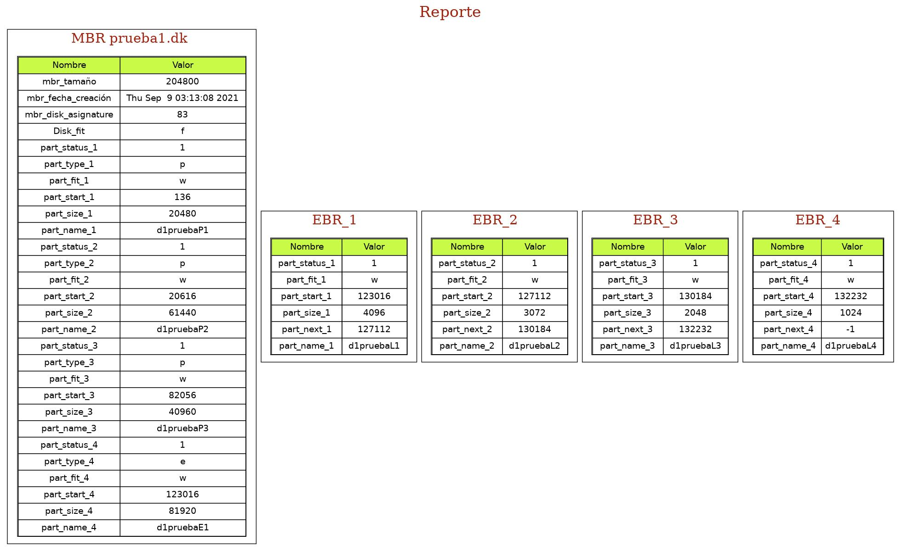
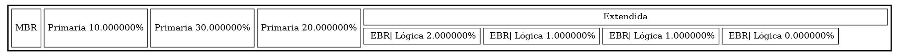

# -MIA-Proyecto1_201800937

-------------------------------------
LABORATORIO MANEJO E IMPLEMENTACION DE ARCHIVOS Sección A-

### Comandos para instalar FLex y Bison

-------------------------------------
<pre><code>sudo apt-get install flex</code></pre>
<pre><code>sudo apt-get install bison</code></pre>

### Comandos para generar el Analizador Léxico y Sintáctico 

-------------------------------------
Primero deben irse a la carpeta del proyecto donde tienen el archivo (.l) y (.y) de los Analizadores, abren una terminal desde esa ubicacion y utilizan los siguientes comandos para generar los analizadores.

#### Analizador léxico
<pre><code>flex --header-file=scanner.h -o scanner.cpp lexico.l</code></pre>
#### Analizador sintáctico
<pre><code>bison -o parser.cpp --defines=parser.h parser.y</code></pre>

### Comandos

-------------------------------------

* Mkdisk: Crea un archivo binario, simulando un disco duro.
* Rmdisk: Borrara el archivo binario.
* Fdisk: Administra las particiones en el archivo que representa al disco duro, es decir, puede crear, agregar o quitar espacio.
* Mount: Montará una partición del Disco en el sistema e imprimira en consola un resumen de todas las particiones. 
* Umount: Desmonta una partición del Sistema.
* Rep: Genera un reporte tipo imagen.
* Exec: Ejecutará un script con comandos.

### Guia de Uso:

-------------------------------------
Se inicia ejecutando el proyecto.

<pre><cod>abraham@jash-linux:~/Escritorio/[MIA]Proyecto1_2S2021$ sudo ./PROYECTO
[sudo] contraseña para abraham:
__________________________________.
|____________PROYECTO1_____________|
|__JOSE ABRAHAM SOLORZANO HERRERA__|
|____________201800937_____________|
.__________________________________.
Ingrese un Comando: 
>></cod></pre>

Se incia creando el disco binario por medio del comando Mkdisk.
<pre><cod>>> mkdisk -path=/home/test1/prueba1.dk -size=200 -u=k -f=ff
SE CREO EL ARCHIVO!!!
</cod></pre>

Se procede a crear 3 Particiones primarias en Kilobytes.
<pre><code>>> fdisk  -path=/home/test1/prueba1.dk -size=20 -name=d1pruebaP1 -u=k
EXISTE EL ARCHIVO!!
PARTICION PRIMARIA CREADA!!!
>> fdisk  -path=/home/test1/prueba1.dk -size=60 -name=d1pruebaP2 -u=k
EXISTE EL ARCHIVO!!
PARTICION PRIMARIA CREADA!!!
>> fdisk  -path=/home/test1/prueba1.dk -size=40 -name=d1pruebaP3 -u=k
EXISTE EL ARCHIVO!!
PARTICION PRIMARIA CREADA!!!
</code></pre>

Después de crear las 3 particiones primarias, se procede a crear una partición extendida, en Kilobytes.
<pre><code>>> fdisk  -path=/home/test1/prueba1.dk -size=80 -name=d1pruebaE1 -u=k -type=e
EXISTE EL ARCHIVO!!
PARTICION EXTENDIDA CREADA!!!</code></pre>

Luego se Procede a crear 3 particiones Logicas.

<pre><code>>> fdisk  -path=/home/test1/prueba1.dk -size=4 -name=d1pruebaL1 -u=k -type=l
EXISTE EL ARCHIVO!!
PARTICION LOGICA CREADA!!!
>> fdisk  -path=/home/test1/prueba1.dk -size=3 -name=d1pruebaL2 -u=k -type=l
EXISTE EL ARCHIVO!!
PARTICION LOGICA CREADA!!!
>> fdisk  -path=/home/test1/prueba1.dk -size=2 -name=d1pruebaL3 -u=k -type=l
EXISTE EL ARCHIVO!!
PARTICION LOGICA CREADA!!!
>> fdisk  -path=/home/test1/prueba1.dk -size=1 -name=d1pruebaL4 -u=k -type=l
EXISTE EL ARCHIVO!!
PARTICION LOGICA CREADA!!!
</code></pre>

Luego se procede a montar 3 particiones.
<pre><code>>> mount -path=/home/test1/prueba1.dk -name=d1pruebaP1
EXISTE EL ARCHIVO!!
------------------------ Particiones Montadas ------------------------
Size: 1
/home/test1/prueba1.dk|d1pruebaP1|371a
----------------------------------------------------------------------
>> mount -path=/home/test1/prueba1.dk -name=d1pruebaP2
------------------------ Particiones Montadas ------------------------
Size: 2
/home/test1/prueba1.dk|d1pruebaP1|371a
/home/test1/prueba1.dk|d1pruebaP2|371b
----------------------------------------------------------------------
>> mount -path=/home/test1/prueba1.dk -name=d1pruebaP3
EXISTE EL ARCHIVO!!
------------------------ Particiones Montadas ------------------------
Size: 3
/home/test1/prueba1.dk|d1pruebaP1|371a
/home/test1/prueba1.dk|d1pruebaP2|371b
/home/test1/prueba1.dk|d1pruebaP3|371c
----------------------------------------------------------------------
</code></pre>

Luego se procede a desmontar una partición.
<pre><code>>> umount -id=371c
Partición Desmontada...
------------------------ Particiones Montadas ------------------------
Size: 2
/home/test1/prueba1.dk|d1pruebaP1|371a
/home/test1/prueba1.dk|d1pruebaP2|371b
----------------------------------------------------------------------

</code></pre>

Por ultimo se procede a generar el Reporte.
<pre><code>
>> rep-id =371a -path=/home/test1/MBR_disco1.jpg -name = mbr
 REPORTE GENERADO! 
</code></pre>

<pre><code>>> rep-id =371b -path=/home/test1/DISK_disco1.jpg -name = disk
 REPORTE GENERADO!
</code></pre>

### Herramientas utilizadas:

-------------------------------------

    C/C++ (Lenguaje de programacion)
    CLion (IDE)
    Linux Ubuntu (Sistema operativo)
    Flex / Bison para el analizador
    Graphviz (Para los reportes)

-------------------------------------
Autor: José Abraham Solórzano Herrera
